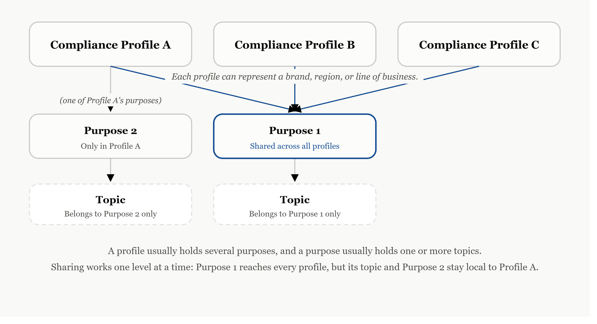

Before you can design a good opt-in form, send a compliant newsletter, or debug why a checkbox will not save, you need one piece of mental model: how Customer Insights - Journeys (CIJ) actually structures consent. It looks simple on the surface and causes real problems the moment you skip past it.

CIJ organizes consent in up to three layers.

A **compliance profile** sits at the top. It is the overall frame, usually tied to a brand, a region, or a line of business. If you run marketing for more than one brand out of the same environment, you will likely have more than one compliance profile.

Below that sit **purposes**. A purpose describes the general reason you are allowed to contact someone: newsletter, event invitations, transactional email. This is the level most people think of when they hear "consent."

Below purposes, optionally, sit **topics**. A topic is a finer subdivision inside a purpose. Say your purpose is "Newsletter": topics let you split that into, for example, a general newsletter and a members-only newsletter, without inventing a second purpose for each variant.

When a contact opts in, the consent gets recorded either at the purpose level, or, if topics exist, at the topic level. Before any marketing email goes out, CIJ checks whether valid consent exists at the right level. No consent, no send. Simple in principle, but the layer you choose to model something at has real consequences later: how flexible your double opt-in emails look, whether something can be reused across compliance profiles, and how much your list of purposes grows as your list of communications grows.

There is one more property worth knowing early, because it changes how you should think about the model from the start: a purpose is not locked to a single compliance profile. The same purpose can be linked into several profiles at once, while a topic cannot, a topic always belongs to exactly one purpose.

Say you run three brands, each with its own compliance profile, but one communication, a shared newsletter, should be available across all three. Model it as a purpose, link that purpose into all three profiles, and a contact's consent for it becomes visible wherever the purpose is linked, even though the profiles themselves stay separate. A topic does not get this. If you need the same fine-grained split available in more than one profile, you end up duplicating it in each one.

This is not an incidental detail, it is a documented part of the model. [Microsoft's own documentation](https://learn.microsoft.com/en-us/dynamics365/customer-insights/journeys/real-time-marketing-compliance-settings) confirms it directly: a purpose can be shared across multiple compliance profiles, while a topic can only ever link to a single purpose. There is even a dedicated toggle when creating a new compliance profile, "Use Previously Captured Consent," that lets a new profile inherit an existing one's purposes instead of creating fresh ones. That toggle is the concrete configuration path for sharing.

That single difference, shareable across profiles versus scoped to one, is usually the deciding factor in whether something belongs on the purpose level or the topic level. It is not just a modeling detail, it is a design decision with real trade-offs, and it is exactly what I want to walk through in the next **recipe**.
